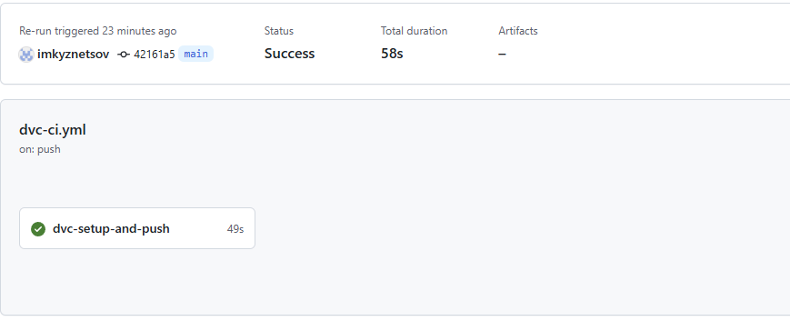

# Автоматизация администрирования MLOps II
# Домашнее задание №2. Части 1, 2 и 3 (HW)

### Цель проекта:
```
Ознакомиться с основами управления данными с помощью DVC, управления экспериментами с 
использованием MLflow и автоматизации с ClearML. Основная задача — интегрировать все 
три инструмента для построения полного цикла ML-проекта.
```

### Структура проекта

```
.
├── ...
├── docs            # вспомогательный, примеры использования 
├── src
│   ├── models      # классы инкапсулирующие работу с моделями
│   ├── services    # слой бизнес-логики
│   └── web         # web-client
└── tests           # unit tests
```

### Часть 1: управление данными с DVC

> [!IMPORTANT] 
> *Задача: использовать DVC для управления данными и построения ML-пайплайнов. 
> Настроить удаленное хранилище и запустить пайплайн с использованием CI/CD.*
 

#### Этапы выполнения (самоконтроль)
`1. Добавление данных в DVC:`
- Добавьте набор данных в проект, используя DVC.
- Закоммитьте изменения и добавьте DVC файлы в Git.

`2. Настройка удаленного хранилища:`
- Настройте удаленное хранилище для DVC (например, Google Drive, AWS S3).
- Убедитесь, что данные могут синхронизироваться с удаленным хранилищем.

`3. Создание и запуск пайплайна:`
- Создайте пайплайн для обработки данных (например, очистка данных или подготовка признаков).
- Закоммитьте пайплайн в DVC.

`4. Интеграция DVC в CI/CD:`
- Настройте пайплайн в CI/CD, который будет автоматически запускать DVC-процесс.
- Убедитесь, что пайплайн может корректно запускать шаги обработки данных.

#### Результат выполнения
