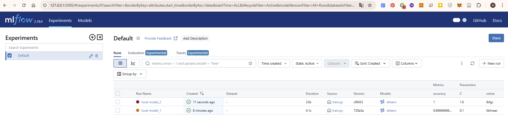
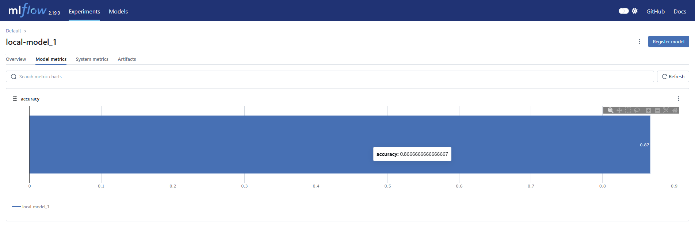
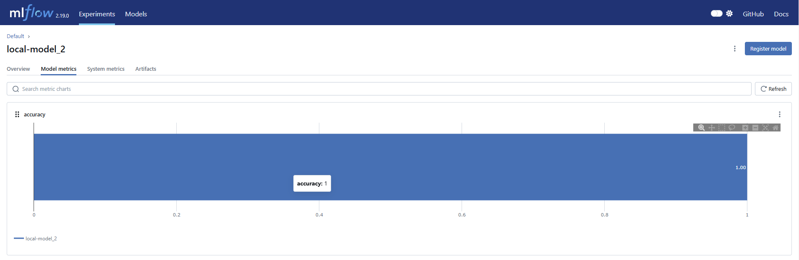
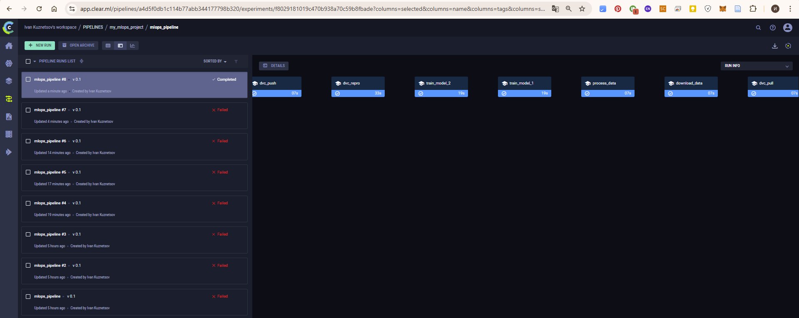

# Автоматизация администрирования MLOps II
# Домашнее задание №2. Части 1, 2 и 3 (HW)

### Цель проекта:
```
Ознакомиться с основами управления данными с помощью DVC, управления экспериментами с 
использованием MLflow и автоматизации с ClearML. Основная задача — интегрировать все 
три инструмента для построения полного цикла ML-проекта.
```

### Структура проекта

```
.
├── ...
├── .dvc                        # data version control folder 
├── .github                     # Метаданные и конфигурация DVC 
│   └── workflows               # GitHub Actions Workflows для CI/CD
│       └── dvc-ci.yml      
├── data                        # Директория для хранения файлов данных
│   ├── iris_dataset.csv        # Исходный датасет
│   └── proc_iris_dataset.csv   # результат обработки
├── docs                        # Вспомогательный, скриншоты выполнения
├── scripts                     # Исходный код для обработки данных и обучения модели
│   ├── download.py             # загрузка датасета
│   ├── pipeline.py             # пайплайн ClearML
│   ├── process_data.py         # обработка датасета
│   └── train.py                # обучение модели, MLflow-эксперименты
.dvcignore                      # Игнорировать файлы, которые не нужно коммитить в DVC
dvc.lock                        # созданные DVC файлы
dvc.yaml                        # созданные DVC файлы
README.md                       # документация проекта
requirements.txt                # зависимости
```

### Часть 1: управление данными с DVC

> [!IMPORTANT] 
> *Задача: использовать DVC для управления данными и построения ML-пайплайнов. 
> Настроить удаленное хранилище и запустить пайплайн с использованием CI/CD.*
 

#### Этапы выполнения (самоконтроль)
`1. Добавление данных в DVC:`
- Добавьте набор данных в проект, используя DVC.
- Закоммитьте изменения и добавьте DVC файлы в Git.

`2. Настройка удаленного хранилища:`
- Настройте удаленное хранилище для DVC (например, Google Drive, AWS S3).
- Убедитесь, что данные могут синхронизироваться с удаленным хранилищем.

`3. Создание и запуск пайплайна:`
- Создайте пайплайн для обработки данных (например, очистка данных или подготовка признаков).
- Закоммитьте пайплайн в DVC.

`4. Интеграция DVC в CI/CD:`
- Настройте пайплайн в CI/CD, который будет автоматически запускать DVC-процесс.
- Убедитесь, что пайплайн может корректно запускать шаги обработки данных.

#### Результат выполнения


### Часть 2: управление экспериментами с MLflow

> [!IMPORTANT] 
> *Задача: настроить MLflow для управления экспериментами и их сравнением*

#### Этапы выполнения (самоконтроль)

`1. Настройка MLflow:`
- Настройте MLflow для локальной работы или используйте удаленное хранилище.
- Убедитесь, что все логи и модели сохраняются корректно.

`2. Запуск экспериментов:`

- Проведите как минимум два эксперимента с разными параметрами моделей.
- Зафиксируйте все метрики экспериментов.

`3. Сравнение моделей:`
- Используйте MLflow для сравнения двух или более моделей по различным метрикам.
- Постройте отчет о производительности моделей.

`4. Документация и отчет:`
Составьте отчет с визуализацией результатов экспериментов, включая графики метрик и выводы.

#### Результаты выполнения


#### Метрики моделей





### Выводы
В целом, эксперимент 2 (в котором были приняты следующие параметры: `C=1.0` и solver=`lbfgs`) показал себя лучше с точки зрения точности (1.0) и времени обучения 3.6 с, чем эксперимент 1 (0.86 и 4.2 с соответственно). Модель, которая обучалась с данными параметрами показывает себя значительно лучше в конкретной задаче.

### Часть 3: автоматизация экспериментов с ClearML

> [!IMPORTANT] 
> *Задача: использовать ClearML для автоматизации процессов, создания и запуска пайплайнов*

#### Этапы выполнения (самоконтроль)

`1. Настройка ClearML:`
- Настройте ClearML сервер и интеграцию с проектом.
- Убедитесь, что все эксперименты логируются и доступны через веб-интерфейс.

`2. Создание и запуск пайплайнов:`
- Создайте автоматизированный пайплайн для запуска экспериментов и обработки данных.
- Запустите пайплайн через ClearML и убедитесь, что все шаги корректно выполняются.

`3. Сравнение моделей:`
- Используйте ClearML для сравнения результатов экспериментов и моделей.
- Составьте отчет с выводами.

`4. Отчет и визуализация:`
- Создайте отчет, содержащий визуализацию экспериментов и моделей, а также анализ результатов.

#### Результаты выполнения


### Выводы
В целом, эксперимент 2 (в котором были приняты следующие параметры: `C=1.0` и solver=`lbfgs`) показал себя лучше с точки зрения точности (1.0) и времени обучения 3.6 с, чем эксперимент 1 (0.86 и 4.2 с соответственно). Модель, которая обучалась с данными параметрами показывает себя значительно лучше в конкретной задаче.

Мы успешно настроили ClearML для автоматизации процессов, создания и запуска пайплайнов. Наш пайплайн сотоял из несколких этапов, а именно `dvc_pull` - скачивания данных с DVC, `download_data` - загрузки исходных данных, `process_data` - обработка данных, `train_model` - обучение моделей, `dvc_repro` - обновление DVC, и, наконец, `dvc_push` - загрузка данных в DVC. На основании проведенных экспериментов нам удалось заключить, что модель `lbfgs` с параметрами C=1.0 дает лучшие результаты с исползованием датасета Iris. После успешной настройки, работать с исследованиями одно удовольствие, что в целом позволяет проводить исследования и другие параметров и моделей.